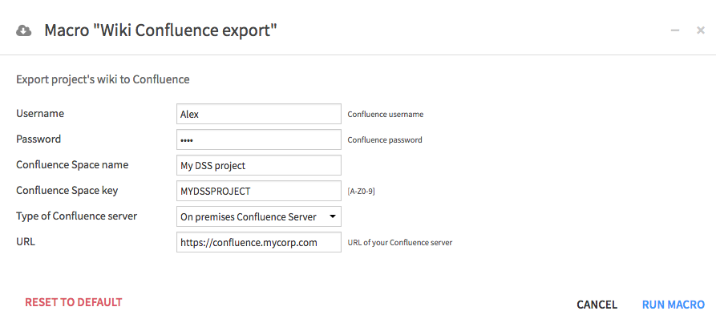

# dss-plugin-confluence
Push your DSS wiki contents to [Confluence](https://www.atlassian.com/software/confluence)

## How to use

Once the plugin installed, navigate to the DSS project containing the wiki pages to push to Confluence. Once in the project, click on *Macro > Wiki Confluence export*

Fill in the following details:

- Your login / password for Confluence
- The space name, if the space has not been created yet
- The space key in which the DSS wiki will be pushed
- The type of server, either on premises or cloud instance
- The url of your on premises confluence server, or
- The organization name pointing to your Confluence cloud space

